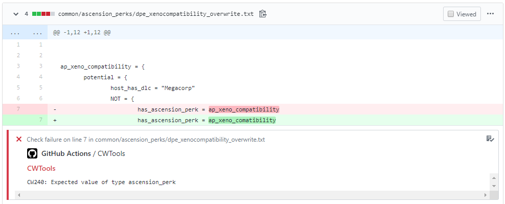

# CWTools Action

Run CWTools on your Clausewitz mod PDXScript code in parallel to your builds.

If CWTools finds errors, warnings or suggestions in the mod code then they will be output.

It will also insert them as inline feedback into your PRs ("Files changed" tab):



## Setup

In most cases, no setup is required beyond adding the following workflow yml file to your project and setting the correct game. See below for advanced configuration and an explanation of the tools used.

The following games require no further setup:

- HOI4
- Stellaris

### Example workflow yml

```yml
name: CWTools CI

on: [pull_request] # also works with push

jobs:
  cwtools_job:
    runs-on: ubuntu-latest
    steps:
    - uses: actions/checkout@v1
    - uses: cwtools/CWTools-action@master
      with:
        game: hoi4
      env:
        GITHUB_TOKEN: ${{ secrets.GITHUB_TOKEN }} # required, secret is automatically set by github

```

The full `output.json` log is saved to `$GITHUB_WORKSPACE`, and can be recovered with [actions/upload-artifact](https://github.com/actions/upload-artifact).

```yml
    - uses: cwtools/CWTools-action@master
      with:
        game: hoi4
      env:
        GITHUB_TOKEN: ${{ secrets.GITHUB_TOKEN }}
    - name: Upload artifact
      if: always() # so even if the check fails, the log is uploaded
      uses: actions/upload-artifact@v1.0.0
      with:
        name: cwtools_output
        path: output.json
```

This action will create a new job called "CWTools", which will be used to annotate your code. Its success or failure state depends on the CWTools output.

## Configuration

### game (required)

What game to use. Allowed values: `hoi4`, `ck2`, `eu4`, `ir`, `stellaris`, `vic2`.

```yml
    - uses: cwtools/CWTools-action@master
      with:
        game: hoi4
      env:
        GITHUB_TOKEN: ${{ secrets.GITHUB_TOKEN }}
```

### cache (optional)

Path to the full cache file (`cwb.bz2`) in `$GITHUB_WORKSPACE` (root of repository). Use an empty string to use metadata from cwtools/cwtools-cache-files (Default: use metadata)

```yml
    - uses: cwtools/CWTools-action@master
      with:
        game: hoi4
        cache: "cache/hoi4.cwb.bz2"
      env:
        GITHUB_TOKEN: ${{ secrets.GITHUB_TOKEN }}
```

### rules (optional)

What rules repository to use (Default: `https://github.com/cwtools/cwtools-$INPUT_GAME-config.git`)

```yml
    - uses: cwtools/CWTools-action@master
      with:
        game: hoi4
        rules: "https://github.com/Yard1/cwtools-hoi4-config.git"
      env:
        GITHUB_TOKEN: ${{ secrets.GITHUB_TOKEN }}
```

### rulesRef (optional)

What ref on rules repo to checkout (Default: `master`)

```yml
    - uses: cwtools/CWTools-action@master
      with:
        game: hoi4
        rulesRef: "1.0.0"
      env:
        GITHUB_TOKEN: ${{ secrets.GITHUB_TOKEN }}
```

### changedFilesOnly (optional)

By default will only annotate changed files, in order to annotate all files set `changedFilesOnly` input to `"0"`.

```yml
    - uses: cwtools/CWTools-action@master
      with:
        game: hoi4
        changedFilesOnly: "0"
      env:
        GITHUB_TOKEN: ${{ secrets.GITHUB_TOKEN }}
```

### suppressedOffenceCategories (optional)

You can choose to suppress annotations with chosen CWTools offence category IDs (`CW###`) per Github severity type (failure, warning, notice).

```yml
    - uses: cwtools/CWTools-action@master
      with:
        game: hoi4
        suppressedOffenceCategories: '{"failure":["CW110", "CW210"], "warning":[], "notice":[]}' # will suppress CW110 and CW210 category failures, but will show those for warnings and notices
      env:
        default: ${{ secrets.GITHUB_TOKEN }}
```

## How this works

[CWTools](https://github.com/tboby/cwtools) is a .NET library that provides features to analyse and manipulate the scripting language used in Paradox Development Studio's games (PDXScript). This is mainly used in a VS Code extension, [cwtools-vscode](https://marketplace.visualstudio.com/items?itemName=tboby.cwtools-vscode). CWTools also provides a CLI tool [CWTools.CLI](https://www.nuget.org/packages/CWTools.CLI/) to allow automated anaylsis, which is what this Action relies on.

This Action relies on two things:

1. A set of valiation rules written for the game your mod is for
2. A cache file containing key information from vanilla files

### Validation rules

The validation rules are taken from the master branch of the public repository for the game, e.g. [https://github.com/cwtools/cwtools-hoi4-config](https://github.com/cwtools/cwtools-hoi4-config). The settings `rules` and `rulesRef` can be used to specify an alternative repo, or to stay on an old version of the rules.

### Vanilla cache file

In order to validate correctly, CWTools requires certain data from the vanilla game files such as defined localisation, variables, etc. There are two formats of cache file:

#### Metadata only

The metadata format contains a limited set of information from vanilla, enough to run the main validator. For convenience CWTools automatically generates these metadata cache files for the latest public rules and latest version of each game. These are found [here](https://github.com/cwtools/cwtools-cache-files) and are used by default in this action (Please note that not all games may be supported yet).

#### Full

The full format contains a more details, processed, version of the vanilla script files. This is required in order to provide accurate validation taking load order and file overrides into account. This is the same format used by cwtools-vscode. We do not provide these files, however this action can be configured to use them.

## Credits

Created by [Yard1](https://github.com/Yard1)

Using [tboby/cwtools](https://github.com/tboby/cwtools).

Based on [gimenete/rubocop-action](https://github.com/gimenete/rubocop-action) by Alberto Gimeno.
